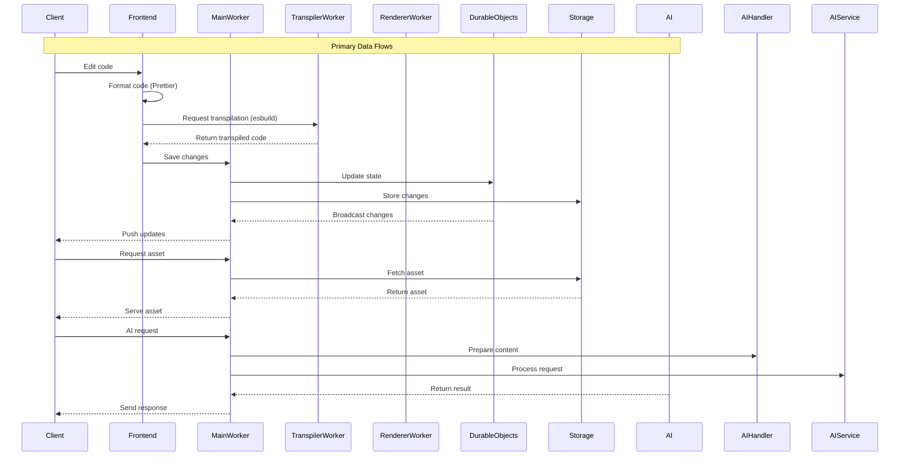
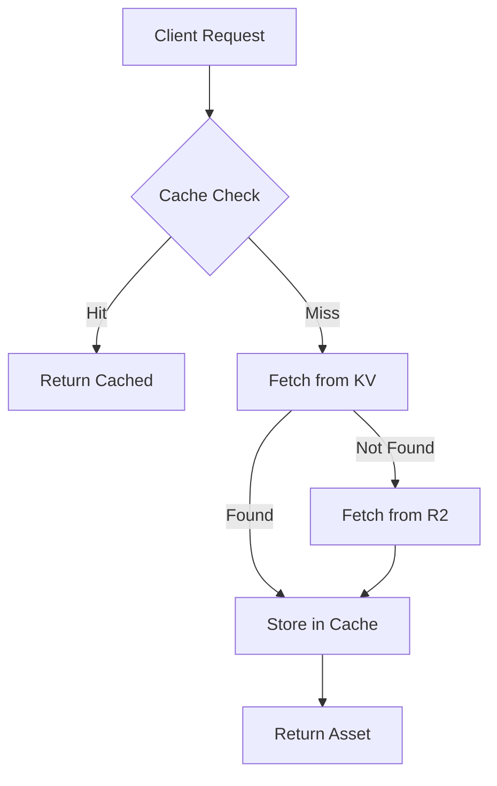
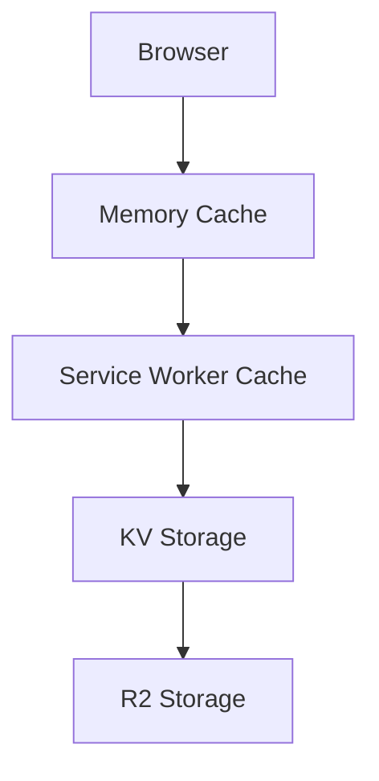
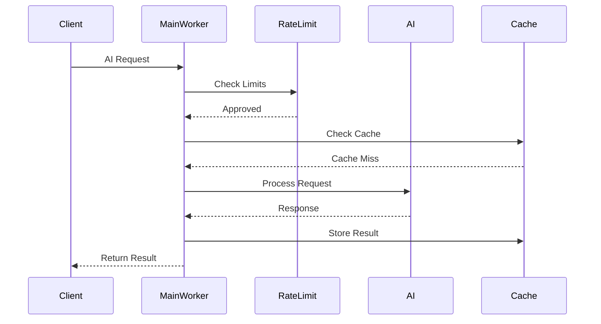
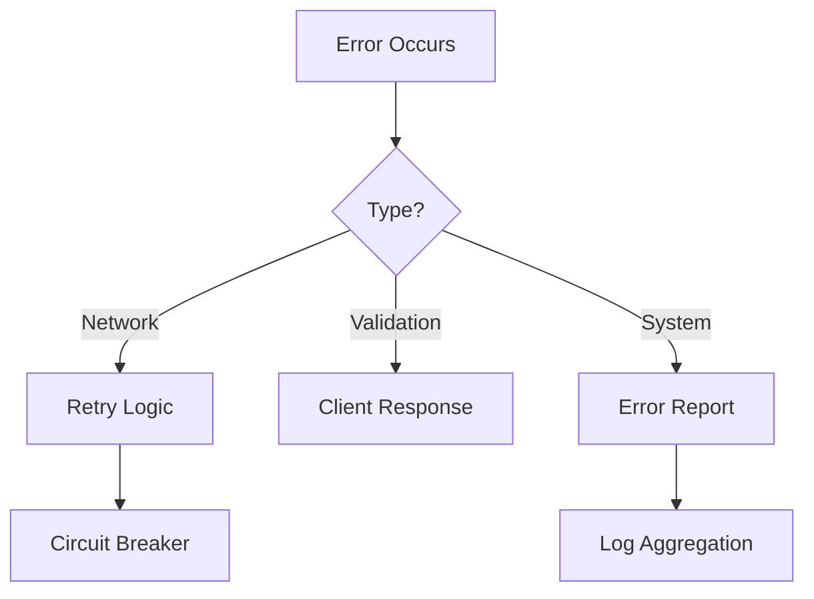
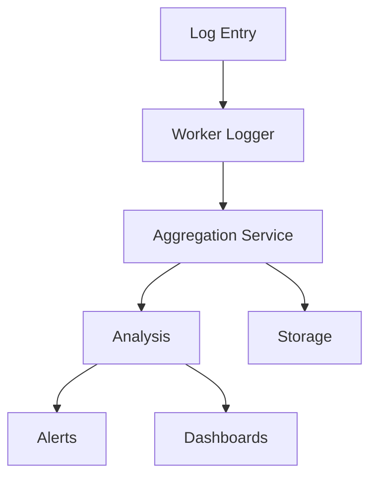

# Data Flow Architecture

## Overview

This document describes how data flows through the spike.land system, including
real-time collaboration, asset serving, and AI interactions.

## Core Data Flows



## Real-time Collaboration Flow

### WebSocket Connection

```typescript
// Example WebSocket setup
class CollaborationManager {
  private ws: WebSocket;

  connect(roomId: string) {
    this.ws = new WebSocket(`wss://spike.land/room/${roomId}`);
    this.ws.onmessage = this.handleMessage.bind(this);
  }

  handleMessage(event: MessageEvent) {
    const update = JSON.parse(event.data);
    this.applyUpdate(update);
  }
}
```

The Main Worker manages WebSocket connections for real-time collaboration.

### State Synchronization

```typescript
// Example state sync
interface StateUpdate {
  type: "insert" | "delete" | "replace";
  position: number;
  content?: string;
  length?: number;
}

function applyUpdate(doc: string, update: StateUpdate): string {
  switch (update.type) {
    case "insert":
      return doc.slice(0, update.position) +
        update.content +
        doc.slice(update.position);
    case "delete":
      return doc.slice(0, update.position) +
        doc.slice(update.position + update.length!);
      // ...
  }
}
```

## Code Processing Flow

### Edit to Execution

1. **Code Input**
   ```typescript
   // Frontend code capture
   editor.onChange((content) => {
     transpileAndExecute(content);
   });
   ```

2. **Transpilation**
   ```typescript
   // Transpiler worker request
   async function transpileCode(content: string) {
     const response = await fetch("https://js.spike.land/transpile", {
       method: "POST",
       body: JSON.stringify({ content }),
     });
     return response.json();
   }
   ```

3. **Execution**
   ```typescript
   // Code execution
   function executeCode(transpiled: string) {
     const worker = new Worker(
       URL.createObjectURL(new Blob([transpiled])),
     );
     worker.onmessage = handleResult;
   }
   ```

## Asset Management Flow

### Static Assets



### Dynamic Assets

```typescript
// Example asset routing
async function routeAsset(request: Request) {
  const url = new URL(request.url);

  // Check if it's a static asset
  if (isStaticAsset(url.pathname)) {
    return serveFromKV(url.pathname);
  }

  // Check if it's a dynamic asset
  if (isDynamicAsset(url.pathname)) {
    return generateAsset(url.pathname, request);
  }

  return new Response("Not Found", { status: 404 });
}
```

## Data Storage Hierarchy

### Storage Tiers



### Cache Strategy

```typescript
// Example cache strategy implementation
async function fetchWithCache(key: string) {
  // Check memory cache
  const memCache = await caches.match(key);
  if (memCache) return memCache;

  // Check KV
  const kvCache = await KV.get(key);
  if (kvCache) {
    await caches.put(key, kvCache);
    return kvCache;
  }

  // Fetch from R2
  const r2Data = await R2.get(key);
  if (r2Data) {
    await KV.put(key, r2Data, { expirationTtl: 3600 });
    return r2Data;
  }
}
```

## AI Integration Flow

### Request Processing



### AI Service Integration

```typescript
// Example AI service router
class AIServiceRouter {
  private services = new Map<string, AIService>();

  constructor() {
    this.services.set("openai", new OpenAIService());
    this.services.set("anthropic", new AnthropicService());
  }

  async route(request: Request) {
    const service = this.getService(request);
    return service.process(request);
  }
}
```

## Error Handling Flow

### Error Propagation



### Error Recovery

```typescript
// Example error recovery
class ErrorHandler {
  async recover(error: Error, context: Context) {
    if (error instanceof NetworkError) {
      return this.handleNetworkError(error);
    }
    if (error instanceof ValidationError) {
      return this.handleValidationError(error);
    }
    return this.handleSystemError(error);
  }
}
```

## Monitoring and Logging Flow

### Data Collection

```typescript
// Example monitoring setup
interface MetricPoint {
  timestamp: number;
  type: string;
  value: number;
  metadata: Record<string, string>;
}

class Monitoring {
  async recordMetric(point: MetricPoint) {
    await this.store(point);
    if (this.isAlertThreshold(point)) {
      await this.alert(point);
    }
  }
}
```

### Log Aggregation



## Related Documentation

- [Frontend Architecture](./frontend.md)
- [Workers Architecture](./workers.md)
- [State Management](./state-management.md)
- [API Documentation](../apis/worker-apis.md)
