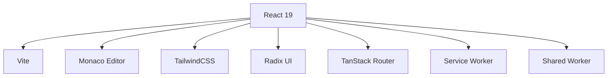
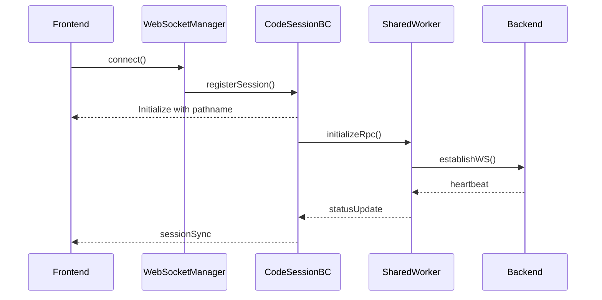

# Frontend Architecture

## Overview

The frontend application (`packages/code`) is a modern React application built with TypeScript, leveraging Vite for development and building. It provides a real-time collaborative code editing experience with Monaco Editor integration and robust routing capabilities.

## Technology Stack



### Core Technologies
- React 19
- TypeScript
- Vite
- Monaco Editor
- TailwindCSS
- Radix UI Components
- TanStack Router
- Service Workers
- Shared Workers

## Application Structure

```
packages/code/
├── src/
│   ├── @/              # Core utilities and components
│   │   ├── components/ # Shared UI components
│   │   ├── hooks/      # Custom React hooks
│   │   ├── lib/        # Utility functions
│   │   └── styles/     # Global styles
│   ├── workers/        # Service and Shared workers
│   ├── routes/         # Application routing
│   │   ├── router.tsx  # Main router configuration
│   │   └── __tests__/ # Route tests
│   ├── services/      # Core services
│   │   ├── CodeSession/  # Code session management
│   │   └── websocket/   # WebSocket communication
│   ├── i18n/          # Internationalization
│   └── App.tsx        # Root component
├── public/            # Static assets
└── tests/            # Test files
```

## Routing Architecture

### Route Configuration

The application uses TanStack Router for type-safe routing with three main route types:

```typescript
// Root landing page
const rootRoute = createRootRoute({
  component: RootLayout,
});

// Editor route with code space
const EditorRoute = createRoute({
  path: "/live/$codeSpace",
  parseParams: (params): RouteParams => ({
    codeSpace: params.codeSpace || "",
  }),
});

// Live page route with code space and page
const liveRoute = createRoute({
  path: "/live/$codeSpace/$page",
  parseParams: (params): RouteWithPageParams => ({
    codeSpace: params.codeSpace || "",
    page: params.page || "",
  }),
});
```

### Route Parameter Types

```typescript
// Route parameters for different routes
interface RouteParams {
  codeSpace: string;
}

interface RouteWithPageParams {
  codeSpace: string;
  page: string;
}

type SearchParams = Record<string, string>;
```

### Route Components

The router integrates with core components:

```typescript
// App component handles route-specific logic
const App: React.FC = () => {
  const [cSess, setState] = useState<ICode | null>(null);
  const codeSpace = getCodeSpace(location.pathname);

  // ... session and initialization logic

  return cSess ? (
    <ClerkProvider>
      <AppToRender codeSpace={codeSpace} cSess={cSess} />
    </ClerkProvider>
  ) : (
    <Wrapper codeSpace={codeSpace} />
  );
};
```

### State Integration

Routes interact with application state through CodeSessionBC:

```typescript
// Example state management in routes
useEffect(() => {
  if (codeSpace && location.pathname === `/live/${codeSpace}`) {
    const cSess = new Code(codeSpace);
    const session = await fetch(`/live/${codeSpace}/session.json`)
      .then(res => res.json<ICodeSession>());
    await cSess.init(session);
  }
}, []);
```

## Key Components

### 1. Editor Integration
```typescript
// Example of Monaco Editor integration
import { MonacoEditor } from '@/components/Editor';

const CodeEditor: React.FC<EditorProps> = ({ value, onChange }) => {
  return (
    <MonacoEditor
      value={value}
      onChange={onChange}
      language="typescript"
      theme="vs-dark"
      options={{
        automaticLayout: true,
        minimap: { enabled: false }
      }}
    />
  );
};
```

### 2. Real-time Communication Architecture

#### WebSocket Layer


#### Session Management
```typescript
class CodeSessionBC {
  private broadcastChannel: BroadcastChannel;
  session: ICodeSession | null = null;
  subscribers: Array<(session: ICodeSession) => void> = [];

  constructor(private codeSpace: string, session?: ICodeSession) {
    this.broadcastChannel = new BroadcastChannel(`/live/${this.codeSpace}/`);
    this.broadcastChannel.onmessage = this.handleMessage.bind(this);
  }

  // ... additional methods
}
```

## Development Flow

### 1. Local Development
```bash
# Start development server
yarn dev

# Component development
yarn dev:vite

# Worker development
yarn dev:workers
```

### 2. Building
```bash
# Production build
yarn build

# Type checking
yarn types:check

# Testing
yarn test
```

## Testing Strategy

### Route Testing
```typescript
// Example route test
describe("Router Configuration", () => {
  it("should handle editor route with code space parameter", async () => {
    await router.navigate({
      to: "/live/$codeSpace",
      params: { codeSpace: "test-space" }
    });

    expect(router.state.location.pathname)
      .toBe("/live/test-space");
  });
});
```

### Integration Testing
- Component interaction testing
- Route parameter validation
- State synchronization testing
- Real-time collaboration testing

## Error Handling

```typescript
// Example route error handler
interface RouteError {
  code: string;
  message: string;
  details?: unknown;
}

const handleRouteError = (error: RouteError) => {
  console.error('Route Error:', error);
  // Implement error handling logic
};
```

## Related Documentation
- [State Management](./state-management.md)
- [Data Flow](./data-flow.md)
- [Build Process](../development/build-process.md)
- [Error Handling](../development/error-handling.md)
