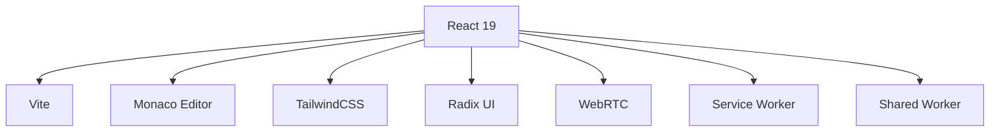

# Frontend Architecture

## Overview

The frontend application (`packages/code`) is a modern React application built with TypeScript, leveraging Vite for development and building. It provides a real-time collaborative code editing experience with Monaco Editor integration.

## Technology Stack



### Core Technologies
- React 19
- TypeScript
- Vite
- Monaco Editor
- TailwindCSS
- Radix UI Components
- WebRTC
- Service Workers
- Shared Workers

## Application Structure

```
packages/code/
├── src/
│   ├── @/              # Core utilities and components
│   │   ├── components/ # Shared UI components
│   │   ├── hooks/      # Custom React hooks
│   │   ├── lib/        # Utility functions
│   │   └── styles/     # Global styles
│   ├── workers/        # Service and Shared workers
│   ├── routes/         # Application routing
│   ├── i18n/          # Internationalization
│   └── App.tsx        # Root component
├── public/            # Static assets
└── tests/            # Test files
```

## Key Components

### 1. Editor Integration
```typescript
// Example of Monaco Editor integration
import { MonacoEditor } from '@/components/Editor';

const CodeEditor: React.FC<EditorProps> = ({ value, onChange }) => {
  return (
    <MonacoEditor
      value={value}
      onChange={onChange}
      language="typescript"
      theme="vs-dark"
      options={{
        automaticLayout: true,
        minimap: { enabled: false }
      }}
    />
  );
};
```

### 2. Real-time Collaboration
- WebSocket connections for real-time updates
- SharedWorker for cross-tab communication
- Operational Transform for conflict resolution

### 3. Service Worker
- Offline functionality
- Asset caching
- Push notifications
- Background sync

### 4. State Management
- React Context for global state
- Local state with useState and useReducer
- SWR for remote data fetching
- Immer for immutable state updates

## Development Flow

### 1. Local Development
```bash
# Start development server
yarn dev

# Component development
yarn dev:vite

# Worker development
yarn dev:workers
```

### 2. Building
```bash
# Production build
yarn build

# Type checking
yarn types:check

# Testing
yarn test
```

## Performance Optimization

### Code Splitting
- Route-based code splitting
- Dynamic imports for large components
- Worker delegation for heavy computations

### Caching Strategy
```typescript
// Example service worker cache configuration
const CACHE_STRATEGY = {
  static: 'cache-first',
  api: 'network-first',
  editor: 'stale-while-revalidate'
};
```

### Bundle Optimization
- Tree shaking with Vite
- Lazy loading of components
- Module federation for shared dependencies

## Testing Strategy

### Unit Testing
```typescript
// Example component test
import { render, fireEvent } from '@testing-library/react';

test('Editor handles input correctly', () => {
  const { getByTestId } = render(<CodeEditor />);
  const editor = getByTestId('code-editor');
  fireEvent.change(editor, { target: { value: 'test' } });
  expect(editor.value).toBe('test');
});
```

### Integration Testing
- Component interaction testing
- Worker communication testing
- Real-time collaboration testing

## Internationalization

### i18next Integration
```typescript
// Example i18n setup
import i18n from 'i18next';

i18n.init({
  lng: 'en',
  fallbackLng: 'en',
  resources: {
    en: { translation: {} },
    es: { translation: {} }
  }
});
```

## Debugging Tools

### Development Tools
- React DevTools
- Performance profiling
- Network monitoring
- Memory leak detection

### Error Handling
```typescript
// Example error boundary
class ErrorBoundary extends React.Component {
  componentDidCatch(error: Error, info: React.ErrorInfo) {
    console.error('Error:', error);
    console.info('Component stack:', info.componentStack);
  }
}
```

## Worker Communication

### Service Worker
```typescript
// Example service worker registration
if ('serviceWorker' in navigator) {
  navigator.serviceWorker.register('/sw.js', {
    scope: '/'
  });
}
```

### Shared Worker
```typescript
// Example shared worker usage
const worker = new SharedWorker('/worker.js', {
  name: 'collaboration-worker'
});

worker.port.postMessage({ type: 'CONNECT' });
```

## Best Practices

### Component Organization
- Smart/Dumb component pattern
- Hooks for logic reuse
- Composition over inheritance
- Consistent file naming

### State Management
- Single source of truth
- Immutable state updates
- Controlled component patterns
- Context segregation

### Performance
- Memoization with useMemo/useCallback
- Virtual scrolling for large lists
- Image optimization
- Code splitting

### Security
- Input sanitization
- XSS prevention
- CSRF protection
- Secure storage handling

## Related Documentation
- [Build Process](../development/build-process.md)
- [Testing Strategy](../development/testing.md)
- [State Management](./state-management.md)
- [Data Flow](./data-flow.md)
