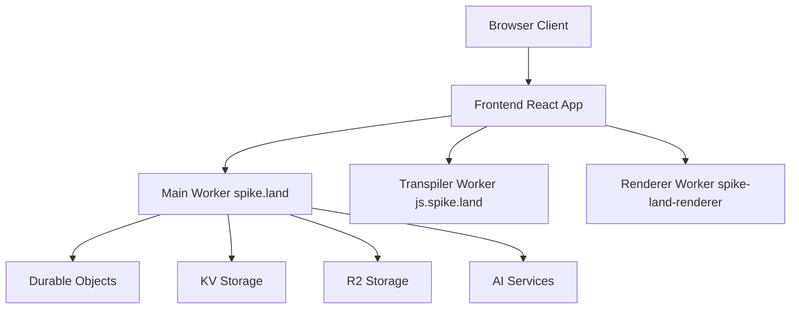

# System Architecture Overview

## High-Level Architecture



## Core Components

### 1. Frontend Application (`packages/code`)

- React 19-based application
- Vite for development and building
- TypeScript for type safety
- Real-time collaborative features
- Monaco Editor integration
- Service Worker for offline capabilities
- WebRTC for peer-to-peer communication

### 2. Main Worker (`packages/testing.spike.land`)

- Primary Cloudflare Worker
- Handles authentication and authorization
- Manages real-time collaboration through Durable Objects
- Integrates with various AI services (OpenAI, Anthropic)
- Serves static assets through KV storage
- No longer manages WebRTC TURN server functionality

### 3. Transpiler Worker (`packages/js.spike.land`)

- Dedicated to code transpilation
- Uses esbuild for fast processing
- Handles TypeScript/JavaScript transpilation
- Manages module resolution and bundling
- Provides caching mechanisms

### 4. Renderer Worker (`packages/spike-land-renderer`)

- Server-side rendering service
- Puppeteer integration for headless browsing
- Generates screenshots and PDFs
- Handles static rendering tasks

### 5. Durable Objects (`packages/durable-objects`)

- Provides stateful services for the application.
- Used for features like real-time collaboration, session management, etc.
- Works in conjunction with the Main Worker.

## Data Flow

1. **Code Editing Flow**
   ```
   Client -> Frontend -> Transpiler Worker -> Frontend -> Main Worker -> Durable Objects
   ```

2. **Collaboration Flow**
   ```
   Client A -> Main Worker -> Durable Objects -> Main Worker -> Client B
   ```

3. **Asset Serving Flow**
   ```
   Client Request -> Main Worker -> KV/R2 Storage -> Client
   ```

## Storage Systems

### Durable Objects

- Chat room state management
- Real-time collaboration coordination
- Rate limiting implementation

### KV Storage

- Static asset serving
- Configuration storage
- Cache management

### R2 Storage

- Large file storage
- Asset versioning
- Backup storage

## External Services Integration

### AI Services

- OpenAI GPT-4 integration
- Anthropic Claude integration
- Whisper for audio transcription
- Replicate for AI model inference

### Authentication

- Clerk.dev integration
- JWT token management
- Session handling

## Development and Deployment

### Local Development

- Concurrent development server setup
- Hot Module Replacement
- TypeScript watch mode
- Worker development through wrangler

### Production Deployment

- Multi-stage build process
- Asset optimization
- Worker deployment to Cloudflare
- Environment-specific configurations

## Performance Considerations

### Edge Computing

- Cloudflare Workers for edge processing
- Global distribution through Cloudflare's network
- Low-latency data access

### Caching Strategy

- KV storage for static assets
- Browser caching through service worker
- Memory caching in workers
- R2 for larger assets

### Real-time Updates

- WebSocket connections for live updates
- WebRTC for peer-to-peer communication
- Durable Objects for state management

## Security

### Authentication

- Clerk.dev integration
- JWT token validation
- Rate limiting implementation

### Data Protection

- End-to-end encryption for sensitive data
- Secure storage in Cloudflare's infrastructure
- Access control through worker middleware

## Monitoring and Debugging

### Logging

- Worker error tracking
- Performance monitoring
- User activity logging

### Debugging Tools

- Browser DevTools integration
- Worker debugging capabilities
- TypeScript source maps

For more detailed information about specific components, please refer to their
respective documentation:

- [Frontend Architecture](./frontend.md)
- [Workers Architecture](./workers.md)
- [Data Flow](./data-flow.md)
- [State Management](./state-management.md)
