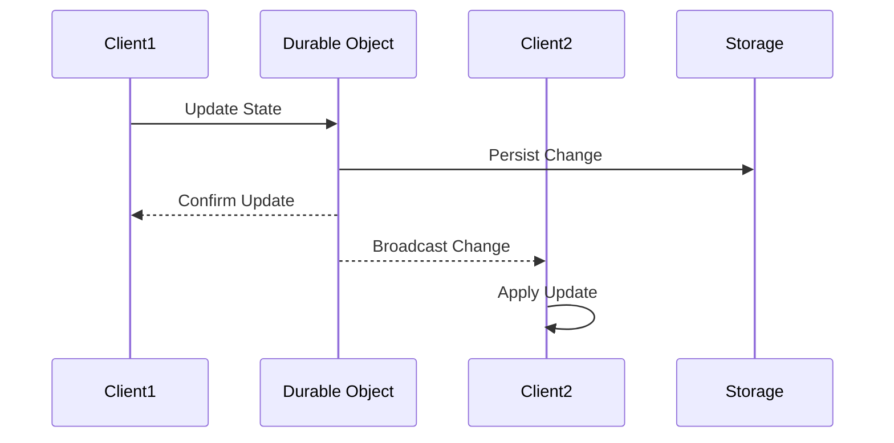
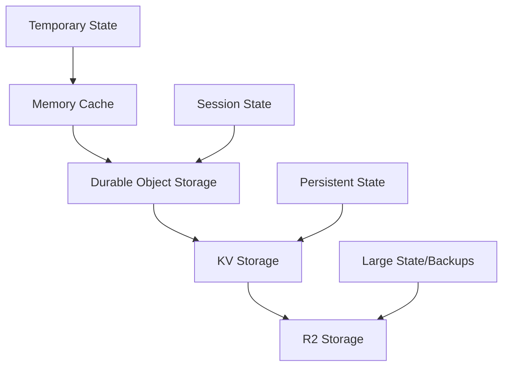

# State Management Architecture

## Overview

The system employs a multi-layered state management approach across different components:
- Frontend state management using React hooks and context
- Worker state management through Durable Objects
- Distributed state coordination across multiple clients
- Persistent state storage in KV and R2

## Frontend State Management

### Component-Level State
```typescript
// Example of local component state
function Editor({ initialCode }: EditorProps) {
  const [code, setCode] = useState(initialCode);
  const [cursor, setCursor] = useState({ line: 0, column: 0 });
  
  const handleChange = useCallback((newCode: string) => {
    setCode(newCode);
    broadcastChange(newCode);
  }, []);
  
  // ...
}
```

### Application State
```typescript
// Example global state context
interface AppState {
  user: User | null;
  theme: 'light' | 'dark';
  collaboration: CollaborationState;
}

const AppStateContext = createContext<AppState>(initialState);

// State provider
export function AppStateProvider({ children }: PropsWithChildren) {
  const [state, dispatch] = useReducer(appReducer, initialState);
  
  return (
    <AppStateContext.Provider value={state}>
      {children}
    </AppStateContext.Provider>
  );
}
```

### State Updates
```typescript
// Example state reducer
function appReducer(state: AppState, action: Action): AppState {
  switch (action.type) {
    case 'UPDATE_CODE':
      return {
        ...state,
        collaboration: {
          ...state.collaboration,
          currentCode: action.payload
        }
      };
    case 'SET_USER':
      return {
        ...state,
        user: action.payload
      };
    // ...
  }
}
```

## Worker State Management

### Durable Object State
```typescript
// Example Durable Object state management
export class CollaborationRoom implements DurableObject {
  private state: DurableObjectState;
  private sessions: Map<string, WebSocket>;
  private document: string;
  
  constructor(state: DurableObjectState) {
    this.state = state;
    this.sessions = new Map();
    
    // Load persistent state
    this.state.blockConcurrencyWhile(async () => {
      this.document = await this.state.storage.get('document') || '';
    });
  }
  
  // Handle state updates
  async updateDocument(newContent: string) {
    await this.state.storage.put('document', newContent);
    this.document = newContent;
    this.broadcastUpdate();
  }
}
```

### Transient Worker State
```typescript
// Example worker memory state
class WorkerStateManager {
  private cache = new Map<string, CacheEntry>();
  private metrics: MetricsCollector;
  
  constructor() {
    this.metrics = new MetricsCollector();
    setInterval(() => this.cleanupCache(), 60000);
  }
  
  async get(key: string) {
    const cached = this.cache.get(key);
    if (cached && !this.isExpired(cached)) {
      return cached.value;
    }
    return null;
  }
}
```

## Distributed State Coordination

### Real-time Synchronization


### State Conflict Resolution
```typescript
// Example operational transform
interface Operation {
  type: 'insert' | 'delete';
  position: number;
  content?: string;
  sourceClient: string;
  timestamp: number;
}

class StateResolver {
  transform(op1: Operation, op2: Operation): Operation {
    if (op1.timestamp < op2.timestamp) {
      return this.adjustOperation(op1, op2);
    }
    return op1;
  }
  
  private adjustOperation(op: Operation, against: Operation): Operation {
    // Implement operational transform logic
    return op;
  }
}
```

## Persistent State Storage

### Storage Hierarchy


### State Migration
```typescript
// Example state migration
class StateMigration {
  async migrateState(version: number) {
    const currentState = await this.loadState();
    
    switch (version) {
      case 2:
        await this.migrateV1ToV2(currentState);
        break;
      case 3:
        await this.migrateV2ToV3(currentState);
        break;
    }
    
    await this.saveState(currentState);
  }
}
```

## State Persistence Strategy

### Write Patterns
```typescript
// Example write strategies
class StateWriter {
  // Immediate write
  async writeImmediate(key: string, value: any) {
    await this.storage.put(key, value);
  }
  
  // Batched write
  private batchedWrites = new Map();
  private batchTimeout: NodeJS.Timeout | null = null;
  
  async writeBatched(key: string, value: any) {
    this.batchedWrites.set(key, value);
    
    if (!this.batchTimeout) {
      this.batchTimeout = setTimeout(
        () => this.flushBatch(),
        1000
      );
    }
  }
}
```

### Read Patterns
```typescript
// Example read strategies
class StateReader {
  // Cached read
  private cache = new Map();
  
  async readCached(key: string) {
    if (this.cache.has(key)) {
      return this.cache.get(key);
    }
    
    const value = await this.storage.get(key);
    this.cache.set(key, value);
    return value;
  }
  
  // Streaming read for large state
  async *readStream(key: string) {
    const stream = await this.storage.getStream(key);
    for await (const chunk of stream) {
      yield chunk;
    }
  }
}
```

## State Monitoring

### Metrics Collection
```typescript
// Example state metrics
class StateMetrics {
  private readonly metrics = new Map<string, number>();
  
  recordAccess(key: string) {
    const current = this.metrics.get(key) || 0;
    this.metrics.set(key, current + 1);
  }
  
  getHotKeys(): string[] {
    return Array.from(this.metrics.entries())
      .sort((a, b) => b[1] - a[1])
      .map(([key]) => key)
      .slice(0, 10);
  }
}
```

### State Health Checks
```typescript
// Example health monitoring
class StateHealth {
  async checkHealth(): Promise<HealthStatus> {
    const checks = await Promise.all([
      this.checkStorage(),
      this.checkConsistency(),
      this.checkReplication()
    ]);
    
    return {
      healthy: checks.every(c => c.healthy),
      details: checks
    };
  }
}
```

## Error Recovery

### State Backup
```typescript
// Example backup strategy
class StateBackup {
  async createBackup() {
    const state = await this.exportState();
    await R2.put(
      `backup-${Date.now()}`,
      JSON.stringify(state)
    );
  }
  
  async restore(timestamp: number) {
    const backup = await R2.get(`backup-${timestamp}`);
    const state = JSON.parse(await backup.text());
    await this.importState(state);
  }
}
```

### Consistency Checks
```typescript
// Example consistency verification
class ConsistencyChecker {
  async verifyState() {
    const refs = await this.collectStateRefs();
    const missing = await this.findMissingRefs(refs);
    
    if (missing.length > 0) {
      await this.repairState(missing);
    }
  }
}
```

## Related Documentation
- [Data Flow](./data-flow.md)
- [Frontend Architecture](./frontend.md)
- [Workers Architecture](./workers.md)
- [Error Handling](../development/error-handling.md)
