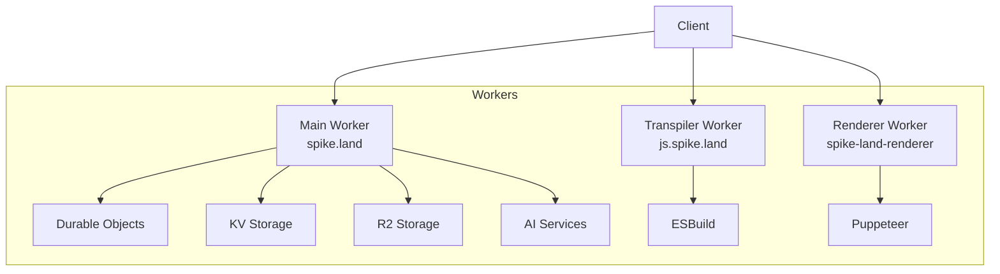

# Workers Architecture

## Overview

The system uses three specialized Cloudflare Workers that work together to
provide different services:



## 1. Main Worker (spike.land)

### Purpose

Serves as the primary backend for the application, handling:

- Authentication and authorization
- Real-time collaboration
- Asset serving
- AI service integration
- No longer manages WebRTC coordination

### Components

#### Durable Objects

```typescript
// Example chat room implementation
export class ChatRoom implements DurableObject {
  private sessions: Map<string, WebSocket>;

  async fetch(request: Request) {
    if (request.headers.get("Upgrade") === "websocket") {
      return this.handleWebSocket(request);
    }
    return this.handleHTTP(request);
  }
}
```

#### Storage Integration

```typescript
// Example KV and R2 usage
async function serveAsset(key: string) {
  // Try KV first for smaller assets
  let asset = await KV.get(key, "arrayBuffer");
  if (!asset) {
    // Fall back to R2 for larger files
    asset = await R2.get(key);
  }
  return new Response(asset);
}
```

#### AI Service Integration

- Uses `AIHandler` to manage interactions with different AI services (OpenAI,
  Anthropic).
- Configures the AI services with API endpoints, throttling, and retry logic.
- Prepares content for AI requests using `prepareClaudeContent`.

```typescript
// Example AI service routing
async function handleAI(request: Request) {
  const service = request.url.includes("/openai") ? openAI : anthropic;
  return service.process(request);
}

// Example AIHandler setup
class AIHandler {
  constructor(private aiService: AIService) {}

  async process(messages: Message[], onUpdate: (code: string) => void) {
    return this.aiService.sendToAI(messages, onUpdate);
  }
}
```

## 2. Transpiler Worker (js.spike.land)

### Purpose

Handles code transpilation and bundling using esbuild:

- TypeScript to JavaScript conversion
- Module bundling
- Code optimization
- Source map generation

### Implementation

#### ESBuild Integration

```typescript
// Example transpilation setup
import * as esbuild from "esbuild-wasm";

async function transpile(code: string) {
  const result = await esbuild.transform(code, {
    loader: "tsx",
    target: "es2024",
    format: "esm",
    sourcemap: true,
  });
  return result;
}
```

#### Caching Layer

```typescript
// Example caching implementation
async function getCachedResult(key: string) {
  const cached = await CACHE.get(key);
  if (cached) {
    return cached;
  }
  const result = await transpile(key);
  await CACHE.put(key, result);
  return result;
}
```

## 3. Renderer Worker (spike-land-renderer)

### Purpose

Provides server-side rendering capabilities:

- HTML generation
- Screenshot capture
- PDF generation
- Static site generation

### Implementation

#### Puppeteer Integration

```typescript
// Example rendering setup
import { launch } from "@cloudflare/puppeteer";

async function renderPage(url: string) {
  const browser = await launch();
  const page = await browser.newPage();
  await page.goto(url);
  const screenshot = await page.screenshot();
  await browser.close();
  return screenshot;
}
```

#### Caching Strategy

```typescript
// Example render caching
async function getCachedRender(url: string) {
  const key = `render:${url}`;
  const cached = await KV.get(key);
  if (cached) {
    return cached;
  }
  const render = await renderPage(url);
  await KV.put(key, render, { expirationTtl: 3600 });
  return render;
}
```

### Service Worker

- Implements caching strategies for static assets.
- Handles offline functionality.
- Manages background updates.

## Inter-Worker Communication

### Direct Communication

```typescript
// Example worker-to-worker fetch
async function fetchTranspiler(code: string) {
  return fetch("https://js.spike.land/transpile", {
    method: "POST",
    body: JSON.stringify({ code }),
  });
}
```

### Shared Resources

- KV namespaces for configuration
- R2 buckets for asset storage
- Durable Objects for state management

## Development Environment

### Local Setup

```bash
# Start all workers
yarn dev:workers

# Start individual workers
yarn workspace @spike-npm-land/code-worker dev
yarn workspace @spike-npm-land/transpile dev
yarn workspace spike-land-renderer dev
```

### Testing

```bash
# Run worker tests
yarn workspace @spike-npm-land/code-worker test
```

## Deployment

### Development

```bash
# Deploy to dev environment
yarn deploy:dev
```

### Production

```bash
# Deploy to production
yarn deploy:prod
```

## Error Handling

### Worker Errors

```typescript
// Example error handling
async function handleRequest(request: Request) {
  try {
    return await processRequest(request);
  } catch (error) {
    console.error("Worker error:", error);
    return new Response("Internal Error", { status: 500 });
  }
}
```

### Circuit Breaking

```typescript
// Example circuit breaker
class CircuitBreaker {
  private failures = 0;
  private lastFailure = 0;

  async execute(fn: () => Promise<Response>) {
    if (this.isOpen()) {
      throw new Error("Circuit breaker is open");
    }
    try {
      return await fn();
    } catch (error) {
      this.recordFailure();
      throw error;
    }
  }
}
```

## Monitoring

### Metrics

- Request counts and latencies
- Error rates
- Worker CPU and memory usage
- Cache hit rates

### Logging

```typescript
// Example structured logging
function logRequest(request: Request, response: Response) {
  console.log(JSON.stringify({
    url: request.url,
    method: request.method,
    status: response.status,
    timestamp: Date.now(),
  }));
}
```

## Security

### Authentication

```typescript
// Example auth middleware
async function authenticate(request: Request) {
  const token = request.headers.get("Authorization");
  if (!token) {
    return new Response("Unauthorized", { status: 401 });
  }
  return verifyToken(token);
}
```

### Rate Limiting

```typescript
// Example rate limiter
export class RateLimiter implements DurableObject {
  private requests = new Map<string, number[]>();

  async checkLimit(ip: string): Promise<boolean> {
    const now = Date.now();
    const recentRequests = this.requests.get(ip) || [];
    const validRequests = recentRequests.filter((time) => now - time < 60000);
    return validRequests.length < 100;
  }
}
```

## Related Documentation

- [Data Flow](./data-flow.md)
- [Build Process](../development/build-process.md)
- [Deployment](../workflows/deployment.md)
- [API Documentation](../apis/worker-apis.md)
