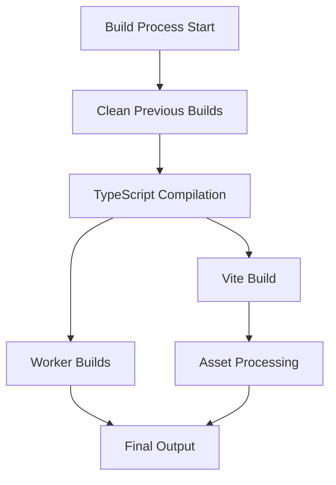

# Build Process

This document details the build system and processes across all packages in the
spike.land monorepo.

## Overview



## Build Scripts

### Root Level Commands

```bash
# Full build process
yarn build:all       # Build everything
yarn build:fe       # Build frontend only
yarn build:workers  # Build workers only

# Clean builds
yarn clean          # Clean all build artifacts

# Type checking
yarn types:check    # Check all packages
yarn types:build    # Build type declarations

# Linting
yarn lint           # Lint all packages
```

### Package-Specific Builds

#### Frontend (`packages/code`)

```bash
# Development
yarn workspace @spike-npm-land/code dev         # Start dev server
yarn workspace @spike-npm-land/code dev:vite    # Vite only
yarn workspace @spike-npm-land/code dev:workers # Workers only

# Building
yarn workspace @spike-npm-land/code build       # Full build
yarn workspace @spike-npm-land/code build:vite  # Vite build
yarn workspace @spike-npm-land/code build:types # TypeScript build
```

#### Main Worker (`packages/testing.spike.land`)

```bash
yarn workspace @spike-npm-land/code-worker build        # Build worker
yarn workspace @spike-npm-land/code-worker build:worker # Worker-specific build
```

#### Transpiler Worker (`packages/js.spike.land`)

```bash
yarn workspace @spike-npm-land/transpile build # Build transpiler worker
```

#### Renderer Worker (`packages/spike-land-renderer`)

```bash
yarn workspace spike-land-renderer build # Build renderer worker
```

## Build Process Details

### 1. Clean Phase

```bash
# Remove previous build artifacts
rm -rf packages/*/dist
rm -rf packages/*/dts
rm -rf .tsBuildInfo
```

### 2. TypeScript Compilation

```typescript
// Example tsconfig.json configuration
{
  "compilerOptions": {
    "target": "ES2020",
    "module": "ESNext",
    "moduleResolution": "bundler",
    "jsx": "react-jsx",
    "allowJs": true,
    "declaration": true,
    "declarationDir": "./dts",
    "sourceMap": true,
    "outDir": "./dist",
    "isolatedModules": true,
    "strict": true
  }
}
```

### 3. Vite Build Process

```typescript
// vite.config.ts example
export default defineConfig({
  build: {
    target: "esnext",
    outDir: "dist",
    rollupOptions: {
      external: [...externals],
      output: {
        manualChunks: {
          vendor: ["react", "react-dom"],
          editor: ["monaco-editor"],
        },
      },
    },
  },
  optimizeDeps: {
    include: ["react", "react-dom"],
  },
});
```

### 4. Worker Builds

#### Main Worker

```toml
# wrangler.toml configuration
name = "spike-land"
main = "./src/cf-workers.ts"
compatibility_date = "2024-09-02"

[build]
command = "yarn build"
```

#### Transpiler Worker

```typescript
// ESBuild configuration
const buildOptions = {
  entryPoints: ["src/index.ts"],
  bundle: true,
  format: "esm",
  target: "es2024",
  outfile: "dist/worker.js",
};
```

### 5. Asset Processing

```typescript
// Asset pipeline configuration
const assetPipeline = {
  images: {
    // Image optimization
    formats: ["webp", "avif"],
    sizes: [640, 1280, 1920],
  },
  styles: {
    // CSS processing
    tailwind: true,
    autoprefixer: true,
    purge: true,
  },
};
```

## Build Environments

### Development

```bash
# Environment variables
NODE_ENV=development
VITE_API_URL=http://localhost:8787
```

### Testing

```bash
# Environment variables
NODE_ENV=test
VITE_API_URL=https://testing.spike.land
```

### Production

```bash
# Environment variables
NODE_ENV=production
VITE_API_URL=https://spike.land
```

## Build Optimization

### Code Splitting

```typescript
// Dynamic imports for route-based code splitting
const Editor = lazy(() => import("./components/Editor"));
const Preview = lazy(() => import("./components/Preview"));
```

### Tree Shaking

```typescript
// Build output analysis
import { visualizer } from "rollup-plugin-visualizer";

export default defineConfig({
  plugins: [
    visualizer({
      filename: "dist/stats.html",
      gzipSize: true,
    }),
  ],
});
```

### Asset Optimization

```typescript
// Asset handling configuration
const assetConfig = {
  inlineLimit: 4096, // Inline assets < 4kb
  assetsDir: "assets",
  assetFileNames: "[hash][extname]",
  chunkFileNames: "[hash].js",
};
```

## Build Verification

### Type Checking

```bash
# Full type check
yarn types:check

# Generate declarations
yarn types:build
```

### Testing

```bash
# Run all tests
vik

# Test specific package
yarn workspace @spike-npm-land/code test

# Linting
yarn lint
```

### Bundle Analysis

```bash
# Generate bundle analysis
yarn build --analyze

# View stats
open dist/stats.html
```

## Deployment Process

### Development Deployment

```bash
# Deploy to development
yarn deploy:dev

# Steps:
1. Build frontend
2. Deploy workers to testing environment
3. Update static assets
```

### Production Deployment

```bash
# Deploy to production
yarn deploy:prod

# Steps:
1. Run production build
2. Deploy workers to production
3. Update CDN assets
4. Invalidate caches
```

## Troubleshooting

### Common Build Issues

1. **Type Errors**
   ```bash
   # Clear TypeScript cache
   rm -rf .tsBuildInfo
   yarn types:check
   ```

2. **Bundle Size Issues**
   ```bash
   # Analyze bundle
   yarn build --analyze
   # Review stats.html for large modules
   ```

3. **Worker Build Failures**
   ```bash
   # Check Wrangler configuration
   wrangler deploy --dry-run
   ```

### Build Logs

Location of important build logs:

- TypeScript: `tsconfig.tsbuildinfo`
- Vite: `node_modules/.vite/`
- Workers: `.wrangler/`

## Related Documentation

- [Getting Started](./getting-started.md)
- [Frontend Architecture](../architecture/frontend.md)
- [Workers Architecture](../architecture/workers.md)
- [Deployment](../workflows/deployment.md)
