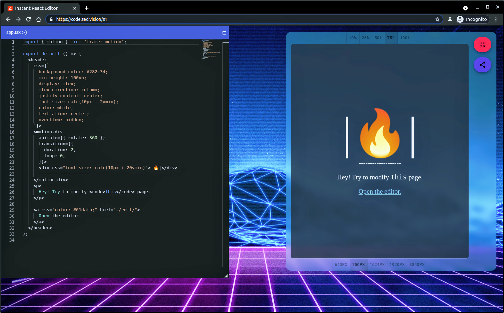

[Real time React page editor, in typescript! ](https://code.zed.vision)

# Hey!

## Above is an editor. 

Its like vscode, doesn't require a developer laptop, it runs in your web browser, and with a button click, generates a html page, which you can share with your friends, if you have any. :)

More features on the way, just keep refresing the page :)

## Built with
- Monaco editor
- typescript
- React
- Emotion.js
- simple-window-manager
- Qruios for QR codes
- Deno
- Node
- Esbuild
- Cloudfire workers + KV
- Worker dom 
- Framer motion
- Workbox
- Indexed DB with idb

