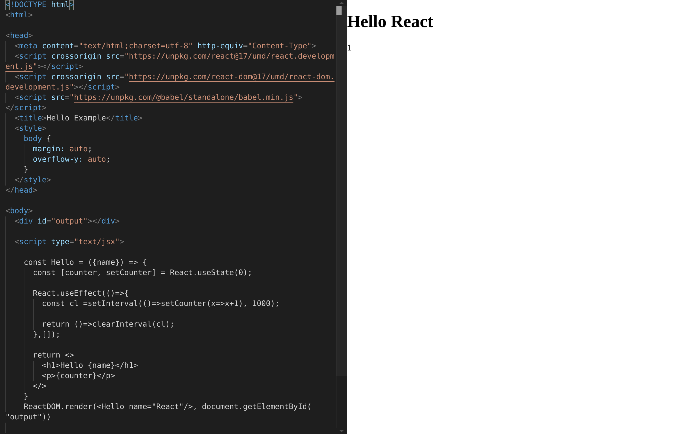

[DEMO - normal html file, without react or any build tool ](https://unpkg.com/@zedvision/smart-monaco-editor/index.html) 

[DEMO - html edit, with babel support ](https://unpkg.com/@zedvision/smart-monaco-editor/exampleHtml.html) 

[DEMO - with react create app ] (https://unpkg.com/@zedvision/smart-monaco-editor-exampl/build/index.html) 

<h1 align="center">smart-monaco-editor</h1>

##examples added

Works with typescript, and it knows jsx as well.

It loads all the necessary files from CDN at runtime, so it wont add extra 10 minutes to your build pipeline.

[Monaco Editor](https://github.com/Microsoft/monaco-editor) for React.
